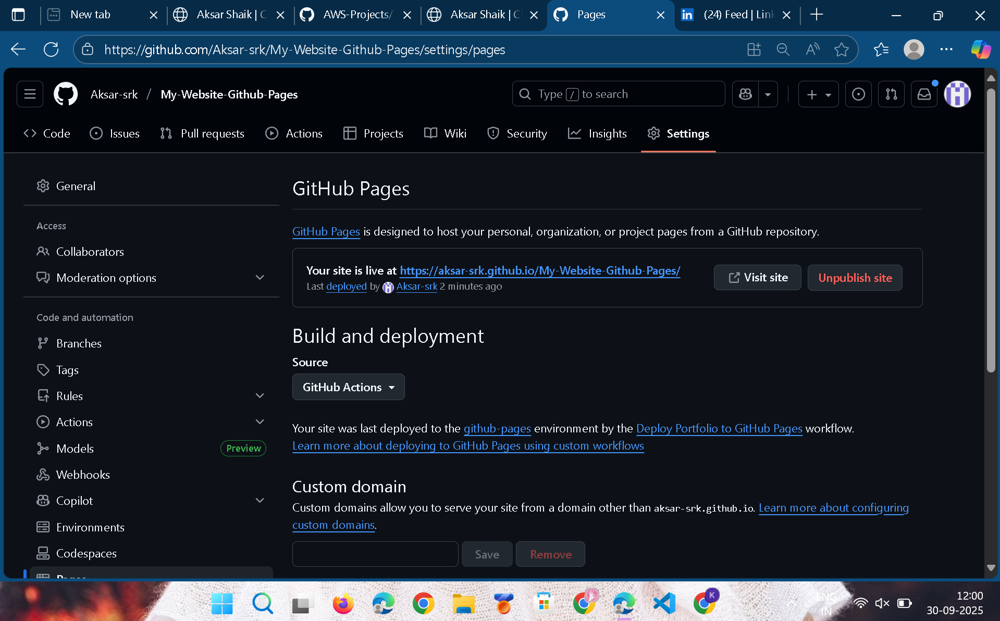
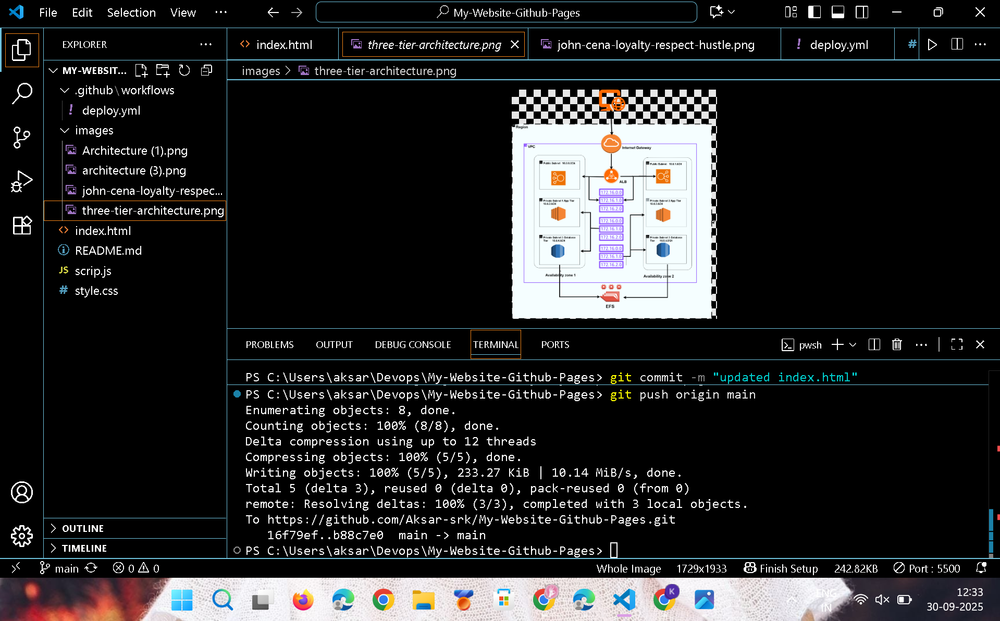
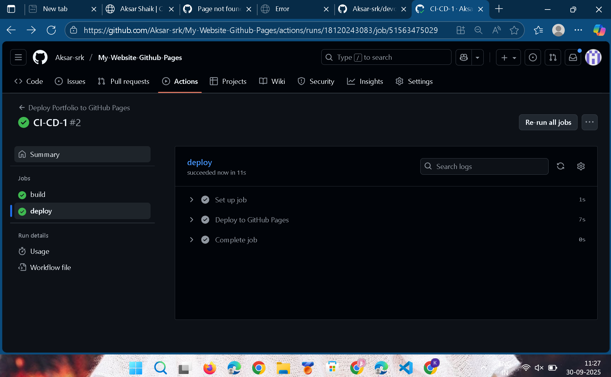
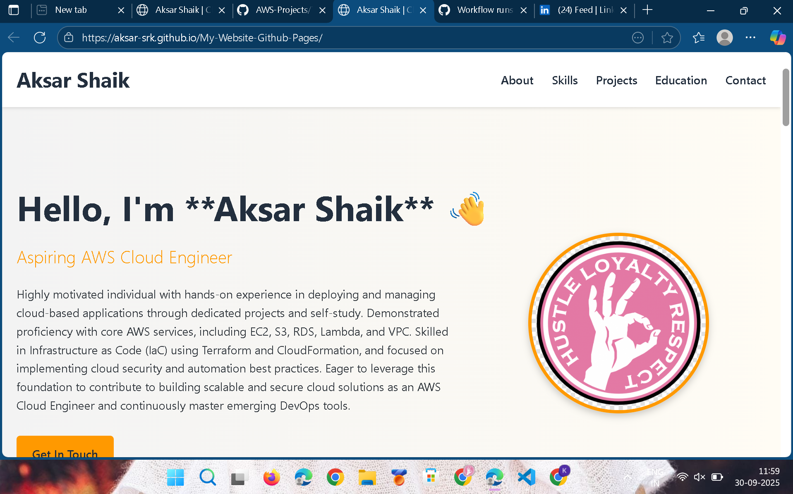
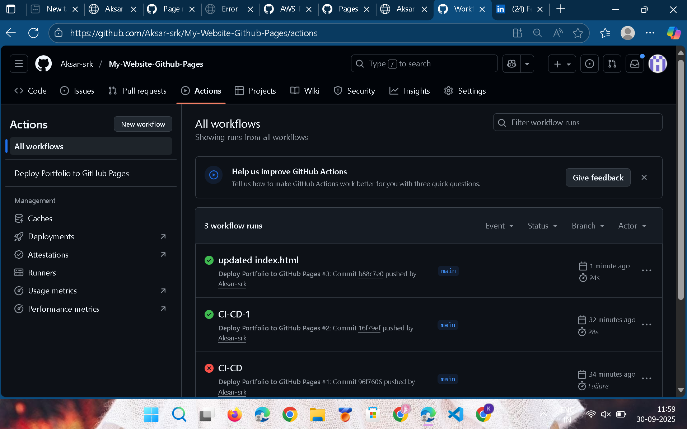

# 🚀 Static Website Deployment & CI/CD Setup

This repository details the process of hosting a static portfolio website using **GitHub Pages** and automating the deployment workflow using **GitHub Actions**. This setup ensures that all code updates pushed to the `main` branch are automatically built and published to the live site.

## 1. Static Website Setup (GitHub Pages)

### 1.1 Initial Deployment

The first step was to establish the static hosting environment using the files present in the repository root.

| File | Purpose |
| :--- | :--- |
| `index.html` | The main structure and content of the portfolio. |
| `style.css` | Styling and responsive design for the website. |
| `script.js` | Basic interactivity and mobile navigation toggle. |
| `*.jpg`, `*.png` | Static assets (profile and project images). |

### 1.2 GitHub Pages Configuration

The website was initially configured via the GitHub repository settings.

1.  Navigate to **Settings** > **Pages**.
2.  Set the **Source** to **Deploy from a branch**.
3.  Select the **`main`** branch and the **`/(root)`** folder.
4.  This created the initial static deployment URL: `https://[Your-Username].github.io/`

---

## 2. CI/CD Implementation (GitHub Actions)

To transition from manual branch deployment to an automated Continuous Integration/Continuous Deployment (CI/CD) pipeline, a GitHub Actions workflow was created.

### 2.1 Workflow File Location

The deployment logic is defined in a YAML file within the standard GitHub Actions directory structure:
```css
.github/
└── workflows/
└── deploy.yml
```


### 2.2 The `deploy.yml` Workflow

This workflow is triggered on every push to the `main` branch and consists of two main jobs: `build` and `deploy`.

| Job/Step | Action Used | Definition |
| :--- | :--- | :--- |
| **`build`** | `actions/upload-pages-artifact@v3` | **Integration (CI):** Checks out the code and bundles the entire repository root (`./`) into a deployable artifact named `github-pages`. |
| **`deploy`** | `actions/deploy-pages@v4` | **Deployment (CD):** Waits for the `build` job to finish, takes the generated artifact, and publishes it to the GitHub Pages environment. |
| **Permissions** | `permissions: pages: write, id-token: write` | Required permissions were set in the workflow YAML to allow the GitHub Actions Runner to interact with and publish to the GitHub Pages service. |

### 2.3 Final Deployment Switch

After pushing the `deploy.yml` file, the GitHub Pages configuration was updated to use the new automated system:

1.  Navigate to **Settings** > **Pages**.
2.  Set the **Source** to **GitHub Actions**.


### 2.4 Monitoring the Pipeline

The deployment process can be monitored under the repository's **Actions** tab. Any commit pushed to the `main` branch now initiates a new workflow run, ensuring the live site is always up-to-date with the code.

| Command | Definition |
| :--- | :--- |
| `git push origin main` | Command used to trigger the automated CI/CD pipeline after code changes. |

| **Actions Tab** | Monitoring dashboard to verify the success of the `build` and `deploy` jobs. |


---

## 3. Quick Links

| Resource | URL/Location |
| :--- | :--- |
| **Workflow File** | `.github/workflows/deploy.yml` |
| **Live Website** | `https://aksar-srk.github.io/My-Website-Github-Pages/` |  

| **GitHub Actions Log** | **Actions** tab in this repository. |



